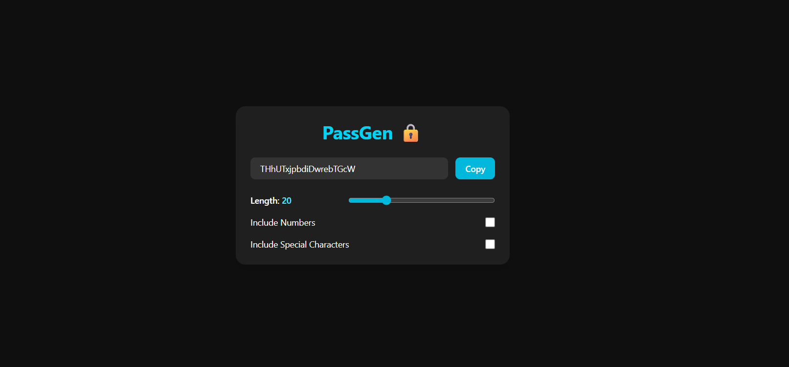

# 🔒 PassGen - Secure Password Generator

A sleek and responsive password generator built with **React** and **Tailwind CSS** that allows users to generate strong, customizable passwords with ease.

---

## ✨ Features

- 🔢 Set desired password length (6–64 characters)
- 🔡 Always includes at least one letter
- 🔠 Option to include **numbers** (0–9)
- 🔣 Option to include **special characters** (`!@#$%^&*()`)
- 🎲 Ensures at least one character from each selected type
- 🔀 Randomized order of characters for added security
- 📋 One-click copy to clipboard
- 📱 Fully responsive for all screen sizes

---

## ⚙️ Tech Stack

- **React** (Vite)
- **Tailwind CSS**
- **JavaScript (ES6+)**
- **HTML/CSS**

---

## 📸 Screenshot

---

## 🧩 How It Works

- Always includes at least **one letter**
- If **"Include Numbers"** is checked → adds at least **one number**
- If **"Include Special Characters"** is checked → adds at least **one symbol**
- The rest of the password is filled with random characters from the allowed set
- Characters are shuffled to avoid predictable order

---

## 👨‍💻 Author

* Swaraj Unde
* GitHub: [@swaraj-unde](https://github.com/swaraj-unde)

---

## 📄 License

This project is open source and free to use.

